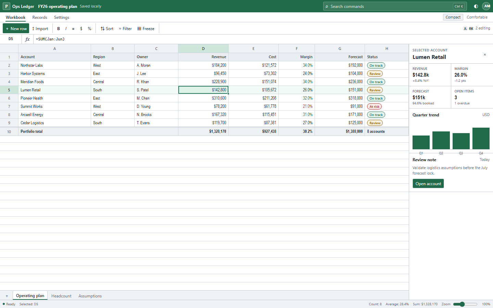

# Precision Grid

> A compact, keyboard-first visual system for professional workspaces where tables, forms, and operational data must remain visible at once.

[Open the interactive demo](./demo/index.html) · [Read the research notes](./RESEARCH.md)



## Choose this style when

Precision Grid is designed for analysis, finance, inventory, administration, reporting, and other desktop productivity workflows. Choose it when users compare many rows, enter data repeatedly, rely on keyboard navigation, or need several controls visible without scrolling.

Reject it for touch-first consumer products, expressive marketing pages, long-form reading, or audiences that need large default targets. Compact density is a task-specific mode, not a universal definition of professional design.

## Visual language

1. **Neutral workspace surfaces.** White data surfaces sit on cool gray application chrome. One deep green is used for primary actions and selection; blue is reserved for focus and links.
2. **Small, deliberate type.** Most text is 11–13px. Hierarchy comes from weight, alignment, background, and grouping rather than dramatic size changes.
3. **One-pixel structure.** Grid lines, dividers, and sticky boundaries organize the interface. Borders carry more hierarchy than shadows.
4. **Tight geometry.** Controls use 3px radii and surfaces use 4px. Pills appear only for statuses, not as the default component shape.
5. **Minimal motion.** State changes complete in 90ms without translation. Data should feel stable while users scan it.
6. **Spreadsheet grammar, not spreadsheet branding.** Formula bars, row and column headers, sheet tabs, frozen columns, selected cells, and status bars are useful layout patterns. Microsoft names, logos, copy, and proprietary icons are not part of the style.

## Runtime usage

```css
@import "style-guides/core.css";
@import "style-guides/themes/precision-grid.css";
```

```html
<main data-style="precision-grid" data-density="compact">
  <section class="sg-card">
    <label for="query">Find record</label>
    <input id="query" class="sg-input" type="search">
    <button class="sg-button sg-button--primary">Apply</button>
  </section>
</main>
```

Use `data-density="comfortable"` for 13px base text, 32px table rows, and 36px controls. Use `data-color-scheme="dark"` for the supplied dark token set. Both attributes can be changed at runtime without replacing component CSS.

## Token contract

The theme implements the shared `--sg-*` contract and adds private `--pg-*` values for grid-heavy compositions.

| Concern | Compact value |
|---|---|
| Base UI type | 12px / 16px |
| Auxiliary type | 11px / 16px |
| Control height | 28px |
| Grid row height | 24px |
| Grid header height | 26px |
| Control radius | 3px |
| Surface radius | 4px |
| Structure | 1px cool-gray border |
| Focus | 2px blue outline, 1px offset |
| Motion | 90ms ease-out, no movement |

Application components should consume public `--sg-*` tokens. Spreadsheet-specific components may use `--pg-font-data`, `--pg-grid-row-height`, `--pg-grid-line`, and the selection variables while this theme is active; do not move those variables into core until another style needs the same semantics.

## Typography

### Font roles

- **Application chrome:** `"Segoe UI Variable", "Segoe UI", Inter, system-ui, sans-serif`.
- **Tables and metrics:** `"Aptos Narrow", "Arial Narrow", "Segoe UI", sans-serif`.
- **Formulae and identifiers:** `"Cascadia Mono", Consolas, ui-monospace, monospace`.

Aptos Narrow is referenced as a locally available Office font and is not bundled. Inter or IBM Plex Sans are suitable cross-platform replacements, but column widths must be retested after any font substitution.

### Type scale

| Role | Size / line height | Weight |
|---|---:|---:|
| Annotation | 10 / 14px | 600 |
| Caption | 11 / 16px | 400–600 |
| UI and data | 12 / 16px | 400 |
| Emphasis | 13 / 18px | 600 |
| Section title | 16 / 22px | 600 |
| Page title | 18 / 24px | 600 |

Use `font-variant-numeric: tabular-nums` for numeric columns, summaries, dates, and durations. Right-align comparable numeric values. Keep labels and text values left-aligned. Avoid 10px text for information required to complete a task.

## Composition

### Workspace anatomy

A full desktop workspace normally follows this order:

1. compact application bar with document identity and global actions;
2. task tabs and grouped toolbar actions;
3. optional name box, query bar, or formula bar;
4. primary grid or dense form occupying most of the viewport;
5. optional inspector panel for the current selection;
6. sheet or view tabs;
7. status bar with counts, validation, and calculation summaries.

Keep the data surface visually continuous. Prefer frozen headers and columns over repeating cards. Use cards only for independent summaries or inspectors; never wrap every row or field in its own elevated surface.

### Spacing and density

Use a 2px base and emphasize 4, 8, 12, and 16px steps. Compact rows are 24px and controls are 28px. A dense table should normally use single-line cells, truncation, and a detail affordance instead of variable row heights.

The comfortable mode increases rows to 32px and controls to 36px. For touch-first screens, use a different style or introduce a dedicated touch mode with at least the target size required by the host product's accessibility standard.

### Responsive behavior

Precision Grid is desktop-first. On narrower screens:

- preserve the table's column geometry with horizontal scrolling;
- collapse secondary toolbar groups before hiding primary actions;
- move inspectors below the grid or into a drawer;
- keep the active cell, row headers, and primary identifier column visible;
- do not turn a wide analytical grid into dozens of unrelated cards unless the task itself changes.

## Interaction states

- **Hover:** a subtle neutral background change; no lift or translation.
- **Active:** inset emphasis or a darker border, completed immediately.
- **Selected cell:** 2px green boundary plus active row and column headers.
- **Focus:** a blue outline independent from green selection, so keyboard focus is never inferred from selection color alone.
- **Read-only:** muted surface plus an explicit icon or label when ambiguity is possible.
- **Error:** red border and text message; never use red fill alone.
- **Loading:** preserve column widths and row geometry to prevent scan-position shifts.

## Framework adapters

Keep semantic CSS variables as the source of truth. A Tailwind adapter can expose them without copying the palette:

```js
export default {
  theme: {
    extend: {
      colors: {
        surface: "var(--sg-color-surface)",
        border: "var(--sg-color-border)",
        primary: "var(--sg-color-primary)",
      },
      borderRadius: {
        control: "var(--sg-radius-control)",
        surface: "var(--sg-radius-surface)",
      },
    },
  },
}
```

Data-grid libraries should map header, row, selection, focus, and density APIs to the theme variables rather than adding a second hard-coded skin.

## Accessibility guardrails

- Compact mode is for mouse and keyboard productivity workflows, not touch-first use.
- Every operation must remain keyboard reachable; spreadsheet grids should use roving `tabindex` and arrow-key navigation rather than making every cell a tab stop.
- Keep visible focus distinct from selection, hover, and validation.
- Do not rely on narrow type below 12px for critical values; offer zoom or comfortable density.
- Communicate sorting, filtering, status, and validation with text or accessible attributes in addition to color.
- Preserve contrast across sticky headers, selected cells, disabled controls, and dark mode.
- Respect reduced motion and avoid animated row reordering while users are scanning values.

## Artifacts

- [`manifest.json`](./manifest.json) — catalog metadata and font roles
- [`theme.css`](./theme.css) — runtime tokens and density modes
- [`PROMPT.md`](./PROMPT.md) — AI implementation brief
- [`RESEARCH.md`](./RESEARCH.md) — source-backed design decisions
- [`demo/index.html`](./demo/index.html) — offline interactive workbook, records table, and compact form
