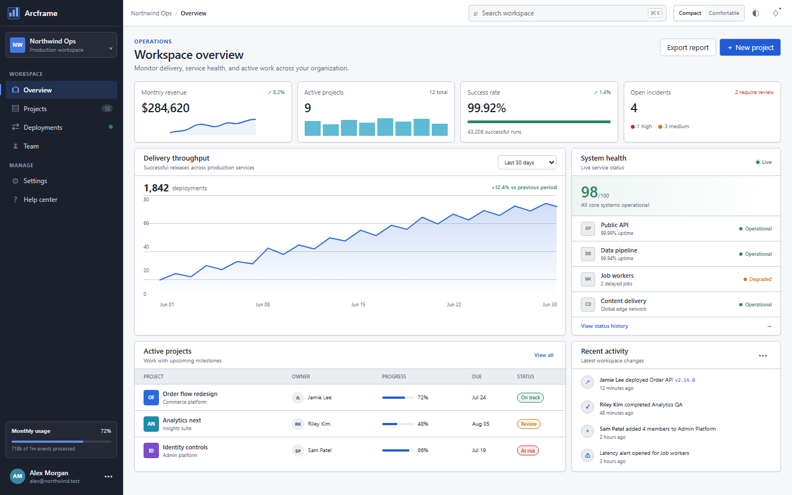

# Precision UI

> A compact, sharp application-page system for SaaS, enterprise, developer, and operational products.

[Open the interactive demo](./demo/index.html) · [Compare with Precision Grid](../precision-grid/README.md)



## Choose this style when

Precision UI works best when users navigate between dashboards, lists, detail views, forms, settings, and account pages throughout the day. It keeps more product context visible than a spacious consumer UI while remaining more flexible and page-oriented than a spreadsheet workspace.

Choose it for SaaS applications, enterprise portals, developer tools, infrastructure products, internal systems, and operational dashboards. Reject it for brand-led marketing pages, touch-first consumer experiences, long-form editorial reading, or playful products whose identity depends on expressive illustration and motion.

## Relationship to Precision Grid

Precision UI and [Precision Grid](../precision-grid/README.md) form a related family:

| Shared foundation | Precision UI | Precision Grid |
|---|---|---|
| Segoe UI/Inter typography, compact controls, one-pixel structure, sharp geometry, minimal motion | Application navigation, dashboards, lists, cards, forms, settings | Spreadsheet navigation, cell selection, formulae, frozen row and column structure |
| Professional, information-rich, keyboard-friendly | 13px base type and 32px controls | 12px base type and 24px rows |
| Restrained color and shallow elevation | Cobalt blue navigation and actions | Green selection and worksheet emphasis |

Do not add formula bars, cell coordinates, sheet tabs, ribbon controls, or an infinite worksheet grid to Precision UI. Use Precision Grid when those interaction models are required.

## Visual language

1. **Crisp application structure.** Sidebars, top bars, panels, and lists are separated by 1px cool-gray borders rather than heavy shadows.
2. **Compact but readable type.** Base UI text is 13/18px. Auxiliary text is 11–12px, section headings are 16–18px, and page titles stay between 20px and 24px.
3. **Sharp geometry.** Controls use 4px radii and surfaces use 6px. Pills are reserved for statuses, counts, and compact filters.
4. **Restrained cobalt accent.** Blue identifies primary actions, active navigation, links, and focus. Success, warning, and danger colors remain semantic rather than decorative.
5. **Measured density.** Controls are 32px in compact mode and 36px in comfortable mode. An 8px rhythm structures page spacing.
6. **Stable interaction.** State transitions complete in 110ms without lift, bounce, or layout movement.

## Runtime usage

```css
@import "style-guides/core.css";
@import "style-guides/themes/precision-ui.css";
```

```html
<div data-style="precision-ui" data-density="compact">
  <main class="sg-card">
    <h1>Workspace overview</h1>
    <input class="sg-input" type="search" placeholder="Search projects">
    <button class="sg-button sg-button--primary">Create project</button>
  </main>
</div>
```

Set `data-density="comfortable"` for 14/20px base type and 36px controls. Set `data-color-scheme="dark"` for the supplied dark token set. Both modes preserve the same component and page structure.

## Token contract

The theme implements the shared 50-token `--sg-*` contract and adds private `--pu-*` page-composition variables.

| Concern | Compact value |
|---|---|
| Base UI type | 13px / 18px |
| Auxiliary type | 11–12px / 16px |
| Control height | 32px |
| Navigation item | 32px |
| Control radius | 4px |
| Surface radius | 6px |
| Structure | 1px cool-gray border |
| Focus | 2px cobalt outline, 2px offset |
| Page padding | 20px |
| Motion | 110ms ease-out, no translation |

Application components should depend on public `--sg-*` tokens. Page-shell implementations may use `--pu-sidebar-width`, `--pu-topbar-height`, `--pu-page-padding`, and chart or navigation variables while this style is active. Keep those private until another style needs identical semantics.

## Typography

### Font roles

- **Application UI:** `"Segoe UI Variable", "Segoe UI", Inter, system-ui, sans-serif`.
- **Code and identifiers:** `"Cascadia Mono", Consolas, ui-monospace, monospace`.
- **Metrics:** the UI stack with `font-variant-numeric: tabular-nums`.

The system does not bundle Microsoft fonts. Segoe UI is used when locally available; Inter or the system UI font preserves the intended proportions elsewhere.

### Type scale

| Role | Size / line height | Weight |
|---|---:|---:|
| Annotation | 10 / 14px | 600, nonessential only |
| Caption | 11 / 16px | 400–600 |
| Secondary UI | 12 / 16px | 400–600 |
| Base UI | 13 / 18px | 400 |
| Emphasis | 14 / 20px | 600 |
| Section title | 16 / 22px | 600 |
| Panel title | 18 / 24px | 600 |
| Page title | 22 / 28px | 600 |

Avoid light font weights at small sizes. Use semibold rather than larger text for compact labels and headings. Keep body copy under approximately 75 characters per line even inside wide dashboards.

## Application anatomy

### Navigation shell

- Use a 224px sidebar or a compact top navigation, not both at full visual weight.
- Navigation items are 32px high and use an icon, short label, active edge, and `aria-current`.
- Separate product-level navigation from account and support actions.
- Keep top-bar search and page actions aligned to the same control height.

### Page header

A normal page header contains breadcrumbs or an eyebrow, a 20–24px title, one short context line, and no more than two visible page-level actions. Filters belong below the title rather than competing with it.

### Panels and lists

Use panels for independent information groups. Within a panel, prefer dividers, rows, definition grids, and compact section headers instead of nesting more cards. A dashboard should usually contain one dominant region and two or three supporting regions, not a uniform wall of identical cards.

### Forms

Align labels, help text, controls, and validation consistently. Use one column for focused settings and two columns only when fields are short and strongly related. Keep section descriptions outside the control grid so users can scan the form structure quickly.

## Spacing and density

Use 8px as the primary spacing unit, with 4, 12, 16, 20, and 24px supporting steps. Default page padding is 20px, panel padding is 16px, and compact control height is 32px.

The comfortable mode raises base type to 14/20px, controls to 36px, page padding to 24px, and panel padding to 20px. Use it for mixed-input environments, less experienced users, or products with longer labels.

## Responsive behavior

- Collapse the sidebar below the product's desktop breakpoint and expose it through a labelled menu button.
- Stack dashboard regions in importance order.
- Preserve list and table geometry with horizontal scrolling when comparison remains the task.
- Move secondary page actions into a menu before hiding primary actions.
- Keep search, breadcrumbs, title, and current navigation context visible.
- Do not shrink controls below compact values to force a desktop page onto a phone.

## Interaction states

- **Hover:** subtle muted fill or border change, no elevation jump.
- **Active:** darker fill or inset emphasis.
- **Current navigation:** cobalt edge plus a tinted background and `aria-current="page"`.
- **Focus:** separate cobalt outline, visible in light and dark modes.
- **Selected:** background and border plus semantic state where applicable.
- **Loading:** skeleton or reserved region with stable dimensions.
- **Empty:** concise explanation and one relevant action, not decorative artwork by default.
- **Validation:** border, message, and semantic attributes; color alone is insufficient.

## Framework adapters

Keep semantic variables canonical:

```js
export default {
  theme: {
    extend: {
      colors: {
        background: "var(--sg-color-background)",
        surface: "var(--sg-color-surface)",
        border: "var(--sg-color-border)",
        primary: "var(--sg-color-primary)",
      },
      borderRadius: {
        control: "var(--sg-radius-control)",
        surface: "var(--sg-radius-surface)",
      },
      minHeight: {
        control: "var(--sg-control-min-height)",
      },
    },
  },
}
```

Keep React, Vue, or other framework components responsible for behavior and composition. The style supplies semantic values and design rules, not a replacement application architecture.

## Accessibility guardrails

- Compact does not mean inaccessible: preserve visible focus, readable contrast, keyboard reachability, and text alternatives.
- Use comfortable density or a dedicated touch mode when 32px controls are too small for the input environment.
- Keep active navigation distinct from hover and focus.
- Do not use 10px text for required instructions, form labels, or data needed to make decisions.
- Ensure charts have textual summaries and never rely on color alone.
- Announce filter results and validation changes where the host framework requires live regions.
- Keep responsive navigation operable by keyboard and restore focus when overlays close.
- Respect reduced-motion preferences.

## Artifacts

- [`manifest.json`](./manifest.json) — catalog metadata
- [`theme.css`](./theme.css) — runtime tokens and modes
- [`PROMPT.md`](./PROMPT.md) — AI implementation brief
- [`demo/index.html`](./demo/index.html) — offline Overview, Projects, and Settings pages
- [`../precision-grid/RESEARCH.md`](../precision-grid/RESEARCH.md) — shared typography and density research basis
